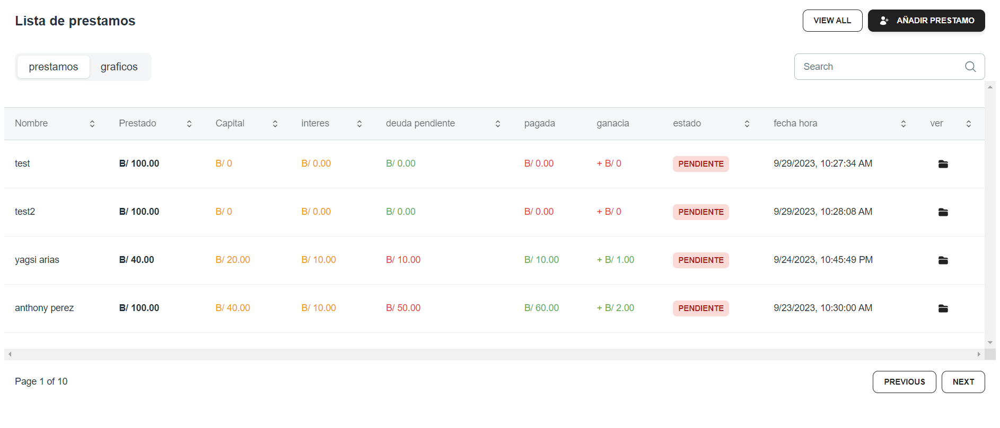

# Sistema de Control de Préstamo

Este proyecto es un sistema simple de control de préstamos diseñado para ayudar a gestionar préstamos de libros, películas u otros elementos. Es una aplicación de consola que permite a los usuarios registrar préstamos, devoluciones y consultar el estado de los préstamos.

## Características

- Registrar préstamos y devoluciones.
- Consultar el estado de los préstamos.
- Facilidad de uso a través de una interfaz.

## Requisitos
- React Js
- Mysql

